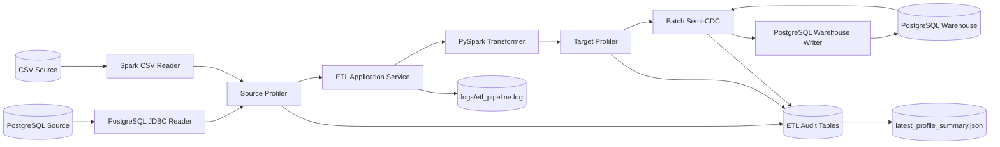

# Mentoring 3 - Bank ETL Pipeline with PySpark

This folder contains the implementation for the third Pacmann Academy data
engineering mentoring exercise. The project integrates PostgreSQL marketing data
and CSV banking transactions into a PostgreSQL data warehouse using PySpark,
Docker Compose, and a modular Python application.

The original exercise is available in
[task_mentoring_3.md](../task_mentoring_3.md).

## Objective

The project addresses three main requirements:

- extract data from PostgreSQL and CSV sources
- transform and standardize the source data with PySpark
- load analytics-ready tables into PostgreSQL using a repeatable full-refresh
  process

The implementation also adds source and target profiling, audit history,
batch-based semi-CDC comparison, centralized logging, retry handling, and an
optional EDA notebook.

## Problem Statement

- Banking data is distributed across a PostgreSQL database and a large CSV
  dataset.
- Source dates, times, gender values, balances, and column names are not fully
  aligned with the warehouse schema.
- The CSV source contains more than one million rows and benefits from Spark-based
  processing.
- Full-refresh loads must be repeatable, observable, and protected from duplicate
  primary keys.

## Data Sources and Targets

| Source | Source Dataset | Warehouse Target |
| --- | --- | --- |
| PostgreSQL `source` | `education_status` | `education_status` |
| PostgreSQL `source` | `marital_status` | `marital_status` |
| PostgreSQL `source` | `marketing_campaign_deposit` | `marketing_campaign_deposit` |
| `data/new_bank_transactions.csv` | customer data | `customers` |
| `data/new_bank_transactions.csv` | transaction data | `transactions` |

The complete field-level mapping is documented in
[docs/source-to-target-map.md](docs/source-to-target-map.md).

## Architecture



The application follows a hexagonal architecture. Application and domain modules
depend on ports, while Spark, JDBC, CSV, PostgreSQL, and filesystem details remain
inside adapters and infrastructure modules.

### Pipeline Flow

1. Read reference and campaign tables from PostgreSQL through JDBC.
2. Read the partitioned banking transaction CSV directory with Spark.
3. Profile each source dataset.
4. Transform the data into the target warehouse schemas.
5. Profile transformed datasets before loading.
6. Compare each transformed dataset with the current warehouse snapshot.
7. Store profiling and semi-CDC audit records.
8. Truncate target tables, append transformed data, and verify row counts.
9. Export the latest audit summary to JSON.

## Transformations

- Remove currency symbols and thousands separators from balance values, then cast
  them to the warehouse numeric type.
- Calculate `duration_in_year` using `floor(duration / 365)`.
- Rename `pdays`, `previous`, and `poutcome` to their target column names.
- Parse legacy `d/M/yy` dates with Spark's `LEGACY` time parser policy.
- Subtract 100 years when a parsed year exceeds `MAX_VALID_YEAR`.
- Map gender values `M` and `F` to `Male` and `Female`; map missing or unknown
  values to `Other`.
- Normalize transaction time to `HH:MM:SS`.
- Store CSV monetary values as `NUMERIC(18,2)` in the warehouse.
- Drop rows with empty primary keys and deduplicate repeated primary keys.

## Data Profiling and Semi-CDC

Each batch records:

- row and column counts
- null counts by column and in total
- duplicate primary-key groups
- the previous successful batch row count
- the row-count difference from the previous batch
- inserted, updated, deleted, and unchanged row counts

The semi-CDC process compares source and warehouse snapshots by primary key and a
SHA-256 hash of the non-key payload. It provides change observability for each
batch, but it is not PostgreSQL WAL-based or event-stream CDC. The final load
strategy remains truncate and append, as required by the exercise.

Audit history is stored in these warehouse tables:

- `etl_pipeline_runs`
- `etl_data_profiles`
- `etl_change_summary`

The latest machine-readable report is written to
`logs/latest_profile_summary.json`.

## Tech Stack

| Layer | Technology |
| --- | --- |
| Language | Python 3.11 or 3.12 |
| Distributed processing | PySpark 3.5.5 |
| Source database | PostgreSQL 16 |
| Data warehouse | PostgreSQL 16 |
| Database connectivity | PostgreSQL JDBC and psycopg2 |
| Local runtime | Docker Compose |
| Dependency management | uv |
| Logging | Loguru |
| Testing and linting | pytest and Ruff |
| Data exploration | JupyterLab and nbconvert |

## Project Structure

```text
ans_mentoring3/
├── README.md
├── Makefile
├── Dockerfile
├── docker-compose.yml
├── pyproject.toml
├── uv.lock
├── .env.example
├── data/
│   └── new_bank_transactions.csv/
├── docker/
│   └── postgres/
│       ├── source/init.sql
│       └── warehouse/init.sql
├── docs/
│   ├── source-to-target-map.md
│   └── latest-etl-run-summary.md
├── drivers/
│   └── postgresql-42.6.0.jar
├── logs/
│   ├── etl_pipeline.log
│   └── latest_profile_summary.json
├── script/
│   └── eda.ipynb
├── src/
│   └── bank_etl/
│       ├── adapters/
│       ├── application/
│       ├── domain/
│       ├── infrastructure/
│       ├── ports/
│       └── main.py
└── tests/
```

### Package Responsibilities

| Package | Responsibility |
| --- | --- |
| `domain` | Dataset definitions, profile models, and change summaries |
| `ports` | Reader, transformer, profiler, writer, and audit contracts |
| `adapters` | CSV, JDBC, PySpark, PostgreSQL, profiling, and semi-CDC implementations |
| `application` | ETL use-case orchestration |
| `infrastructure` | Configuration, Spark session, logging, and retry support |
| `main.py` | Dependency wiring and application entrypoint |

## Containers

| Service | Purpose | Host Port |
| --- | --- | ---: |
| `source_db` | PostgreSQL source database | 5438 |
| `data_warehouse` | PostgreSQL warehouse and audit database | 5439 |
| `spark_etl` | PySpark ETL runtime | 4040 |
| `notebook` | Optional JupyterLab EDA environment | 8888 |

Spark runs as `local[4]` inside one container with 1 GB driver memory, eight
shuffle partitions, and a default container memory limit of 2 GB. A standalone
Spark cluster is not used because all compute resources are on the same Docker
host and the current workload does not justify the additional coordination
overhead.

## Prerequisites

- Docker Engine or Docker Desktop with Docker Compose v2
- GNU Make for the provided command shortcuts
- at least 2 GB of memory available to the Spark container
- Python 3.11 or 3.12, Java 17, and `uv` for local development

The Docker workflow does not require Python, Java, or `uv` to be installed on the
host.

## Setup

Run all commands from the `ans_mentoring3` directory.

### 1. Create the Environment File

```bash
cp .env.example .env
```

The default values work with the included Docker Compose configuration. Update
ports, passwords, or Spark resources in `.env` when required.

### 2. Check Required Files

Confirm that these files are available before building the containers:

- `data/new_bank_transactions.csv/`
- `drivers/postgresql-42.6.0.jar`
- `docker/postgres/source/init.sql`
- `docker/postgres/warehouse/init.sql`

### 3. Run the ETL Pipeline

```bash
make run
```

This command builds the ETL image, starts both PostgreSQL services, runs the full
pipeline, and returns the ETL container's exit code.

For later batches that reuse the existing database volumes:

```bash
make rerun
```

### 4. Inspect the Results

```bash
make summary
make report
```

`make summary` displays the latest run status, warehouse row counts, profiles,
and semi-CDC results. `make report` prints
`logs/latest_profile_summary.json`.

### 5. Stop the Services

```bash
make down
```

This preserves the database volumes. Use `make reset` only when both databases
must be reinitialized from their SQL scripts.

## Available Commands

Run `make help` to display the command list maintained by the Makefile.

| Command | Purpose |
| --- | --- |
| `make config` | Validate the Docker Compose configuration |
| `make build` | Build the Spark ETL runtime image |
| `make up` | Start the source and warehouse databases |
| `make run` | Build and run the complete ETL stack |
| `make rerun` | Run another batch using existing database volumes |
| `make status` | Display Docker Compose service status |
| `make counts` | Display warehouse business-table row counts |
| `make audit` | Display the latest pipeline audit record |
| `make profiles` | Display source and target profiles for the latest run |
| `make changes` | Display the latest semi-CDC comparison |
| `make summary` | Display audit, counts, profiles, and changes |
| `make report` | Print the latest JSON profile report |
| `make warehouse-shell` | Open an interactive warehouse `psql` session |
| `make logs` | Follow the persistent application log |
| `make eda` | Start the optional JupyterLab service |
| `make eda-execute` | Execute the EDA notebook headlessly |
| `make lock-check` | Verify that `uv.lock` matches `pyproject.toml` |
| `make test` | Run the pytest suite |
| `make lint` | Run Ruff checks |
| `make check` | Run lock validation, linting, and tests |
| `make down` | Stop containers without deleting database volumes |
| `make reset` | Stop containers and delete database volumes |

## Main Configuration

The default configuration is defined in `.env.example` and Docker Compose.

| Variable | Default | Purpose |
| --- | --- | --- |
| `SOURCE_DB_HOST_PORT` | `5438` | Source database port on the host |
| `WAREHOUSE_DB_HOST_PORT` | `5439` | Warehouse database port on the host |
| `SPARK_MASTER` | `local[4]` | Spark execution mode and local thread count |
| `SPARK_DRIVER_MEMORY` | `1g` | Spark driver heap size |
| `SPARK_SHUFFLE_PARTITIONS` | `8` | Spark SQL shuffle partition count |
| `SPARK_CONTAINER_MEMORY` | `2g` | ETL container memory limit |
| `MAX_VALID_YEAR` | `2025` | Maximum year before legacy-date correction |
| `RETRY_ATTEMPTS` | `3` | Maximum database operation attempts |
| `LOG_PATH` | `/app/logs/etl_pipeline.log` | Persistent application log path |
| `PROFILE_REPORT_PATH` | `/app/logs/latest_profile_summary.json` | Latest JSON report path |

## EDA Notebook

The notebook at `script/eda.ipynb` checks row counts, column counts, schemas,
samples, duplicate keys, and missing values for the PostgreSQL and CSV sources.
It uses the same project configuration, Spark session setup, and JDBC driver as
the ETL application.

### Run with Docker

```bash
make eda
```

Open `http://localhost:8888/lab/tree/script/eda.ipynb` and run all cells. The
development service does not require a token, so port `8888` should not be exposed
to an untrusted network.

### Run Directly in VS Code

Prepare the local environment and databases:

```bash
uv sync
make up
```

Select the Python interpreter from `ans_mentoring3/.venv/bin/python`, then run all
notebook cells. Java 17 must be available because PySpark starts a local JVM.

When the notebook runs outside Docker, it uses the host database ports `5438` and
`5439` and resolves the data, JDBC driver, and log paths from the project root.

### Run Headlessly

```bash
make eda-execute
```

The command starts the databases, builds the development image, executes every
cell with `nbconvert`, and writes the outputs back to `script/eda.ipynb`.

## Local Development

Install dependencies and run the repository checks:

```bash
uv sync
make check
```

Equivalent individual commands:

```bash
uv lock --check
uv run ruff check src tests
uv run pytest
```

Latest local test result:

```text
7 passed
```

## Latest Validated Run

The latest stored machine-readable report was generated from a clean database
initialization on June 14, 2026 WIB (June 13, 2026 UTC).

| Item | Result |
| --- | --- |
| Run ID | `c0a2e914-b5ac-44db-92a3-6658ed1d2daf` |
| Status | `SUCCEEDED` |
| Duration | 59.49 seconds |
| Spark master | `local[4]` |
| Profiles stored | 9 datasets |
| Semi-CDC summaries stored | 5 target tables |

### Warehouse Results

| Target | Rows | Inserted | Updated | Deleted | Unchanged |
| --- | ---: | ---: | ---: | ---: | ---: |
| `education_status` | 4 | 4 | 0 | 0 | 0 |
| `marital_status` | 3 | 3 | 0 | 0 | 0 |
| `marketing_campaign_deposit` | 45,211 | 45,211 | 0 | 0 | 0 |
| `customers` | 1,048,567 | 1,048,567 | 0 | 0 | 0 |
| `transactions` | 1,048,567 | 1,048,567 | 0 | 0 | 0 |

Because both database volumes were deleted before this run, there was no previous
audit baseline and every warehouse row was correctly classified as inserted. The
CSV source profile contains 3,620 null values, while the transformed `customers`
target contains 5,917 null values after parsing and normalization. The additional
target nulls come mainly from invalid or empty date-of-birth strings that become
null after date parsing.

## Reliability and Logging

- JDBC and PostgreSQL connections use connect, socket, and statement timeouts.
- Extraction and warehouse refresh operations use exponential-backoff retries.
- A load retry covers the complete truncate, append, and row-count validation
  cycle, which keeps retries idempotent after a partial failure.
- Pipeline status, profiles, row-count differences, and semi-CDC results are
  stored in warehouse audit tables.
- Loguru writes DEBUG-level application logs to `logs/etl_pipeline.log`, with
  25 MB rotation, 30-day retention, and compression.
- Python standard logging and Py4J messages are redirected to Loguru. Spark JVM
  logs may still appear in Docker output and are limited to WARN where possible.

## Known Limitations

- Truncate and append can expose an empty or partially loaded table to active
  readers. A production system should use staging tables with an atomic swap or
  an appropriate transactional loading strategy.
- Semi-CDC scans the full source and warehouse snapshots. Its cost grows with the
  table size, and it is not a replacement for WAL- or event-based CDC.
- The JSON report stores only the latest run; complete history remains in the
  warehouse audit tables.
- The project does not currently include a migration framework or an external
  scheduler/orchestrator.
- Spark runs on one host with `local[4]`; there is no executor distribution or
  high-availability configuration.

## Notes

- PostgreSQL keeps the `postgres` user because the provided source SQL dump assigns
  object ownership to that user.
- PostgreSQL initialization scripts run automatically only when their data volumes
  are empty. Use explicit migration SQL for an existing database.
- Audit tables grow after every batch and do not yet have automatic retention.
- Update `uv.lock` and rebuild the Docker image whenever project dependencies
  change.
- Scale Spark memory and partition settings from workload measurements rather than
  from source file size alone.

---

<div align="center">

### Mentoring 3 - Bank ETL Pipeline with PySpark

This project was created as part of the learning program at
<strong>Pacmann Academy Bootcamp</strong>.

<a href="https://pacmann.io">
  
</a>

<a href="https://pacmann.io">pacmann.io</a>

</div>
