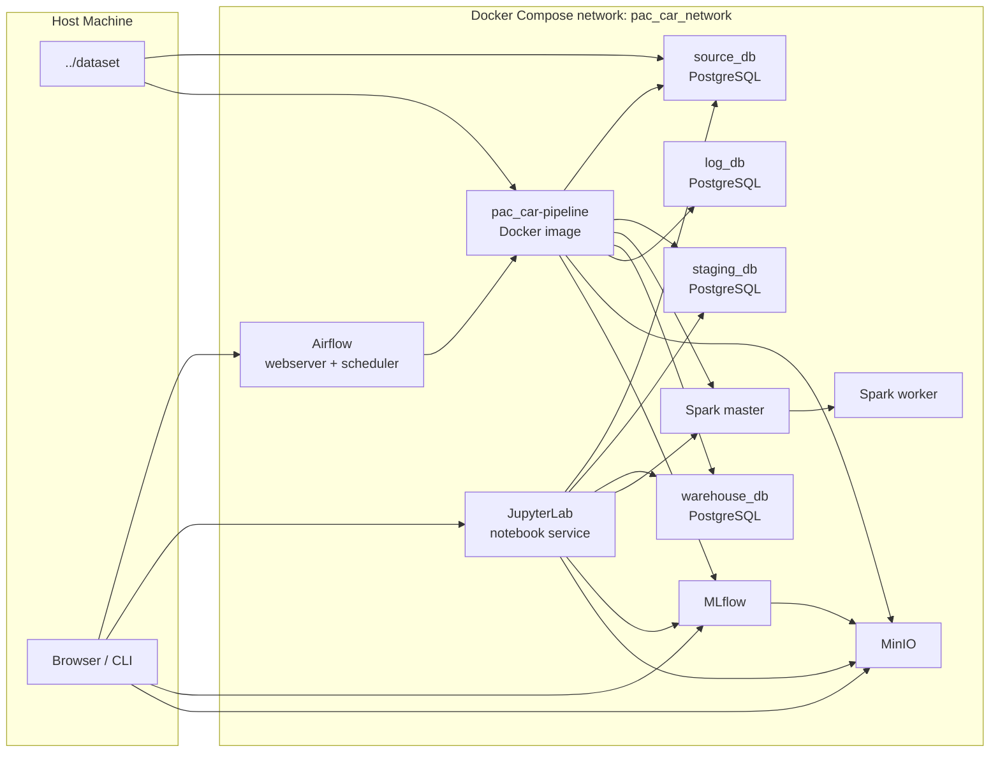
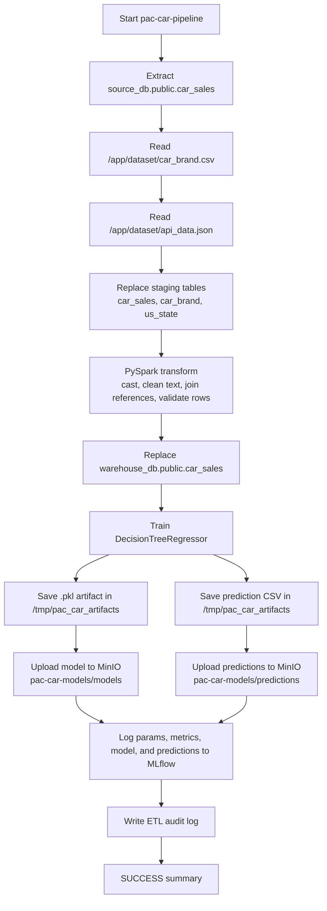
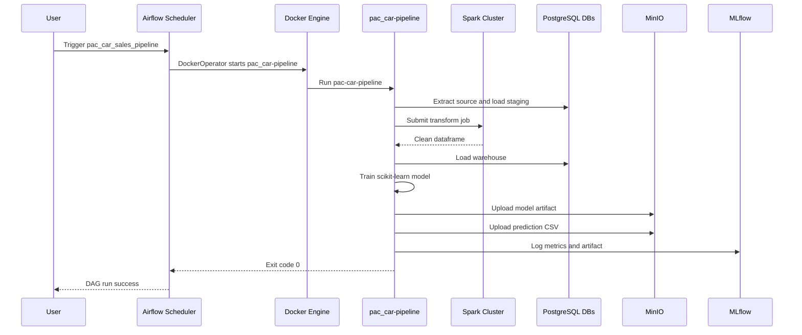
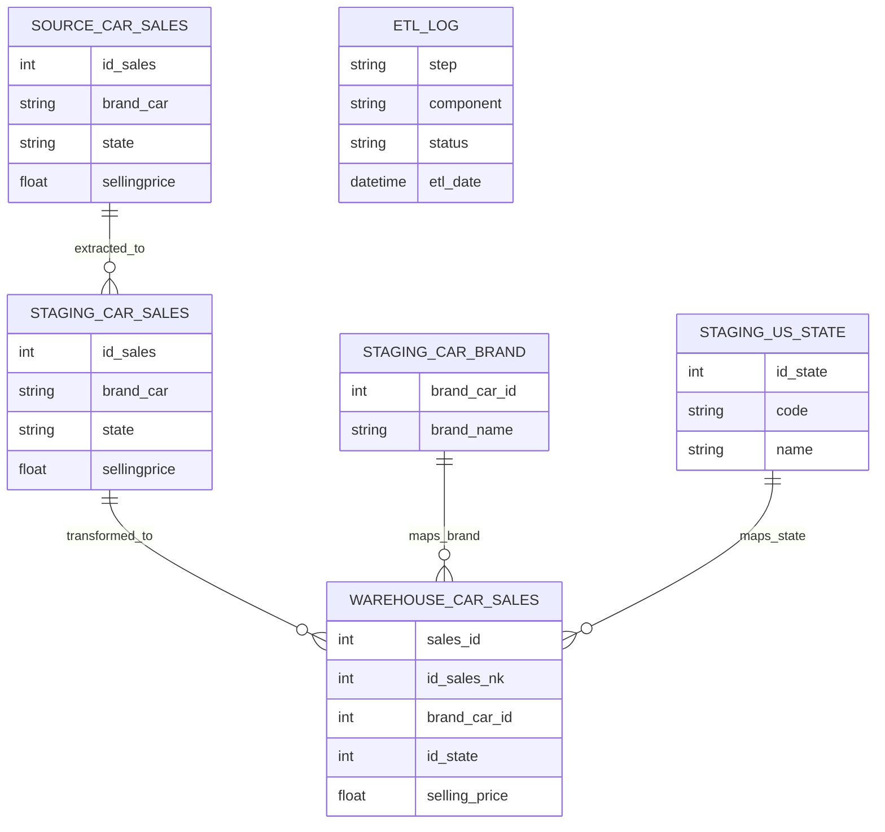

# Mentoring 4 - Car Sales ETL and ML Pipeline with PySpark

This folder contains the implementation for the fourth Pacmann Academy data
engineering mentoring exercise. The project integrates PostgreSQL car sales,
spreadsheet-style brand reference data, and API-style state reference data into a
model-ready PostgreSQL warehouse. It then trains and evaluates a car selling-price
regression model using PySpark, scikit-learn, Airflow, MLflow, and MinIO.

The original exercise is available in
[task_mentoring_4.md](../task_mentoring_4.md). A beginner-oriented explanation of
the project and its prediction logic is available in
[project_explanation.md](project_explanation.md). The latest clean-start validation
is documented in [report_summary.md](report_summary.md).

## Objective

The project addresses four main requirements:

- extract car sales and reference data from multiple sources
- clean, validate, and integrate the data into a warehouse with PySpark
- train and evaluate a supervised regression model for `selling_price`
- publish reproducible model, prediction, metric, and audit artifacts

The implementation also adds Docker Compose orchestration, Airflow scheduling,
centralized logging, PostgreSQL ETL audit records, MLflow experiment tracking, MinIO
object storage, and a Docker-based exploration notebook.

## Problem Statement

- Sales transactions, brand references, and state references are stored separately.
- Raw text and numeric values are not consistently formatted for warehouse loading.
- Brand names and state codes must be mapped to stable warehouse identifiers.
- Invalid and duplicate rows must not enter the model-ready warehouse.
- Model training must use repeatable preprocessing and produce traceable artifacts.
- Pipeline runs must be observable and reproducible from one Docker Compose stack.

This is a supervised regression problem because historical `sellingprice` values are
available and are normalized in the warehouse as the `selling_price` target.

## Requirement Completion

| Requirement | Status | Implementation |
| --- | --- | --- |
| Explore the source data | Complete | [notebooks/data_exploration.ipynb](notebooks/data_exploration.ipynb) profiles shape, data types, missing values, numeric values, and categories. |
| Extract database data | Complete | `CarSalesExtractor` reads `source_db`, staging, and warehouse tables. |
| Extract spreadsheet data | Complete | `BrandReferenceClient` reads the copied `dataset/car_brand.csv` fixture. |
| Extract API data | Complete | `StateReferenceClient` supports REST extraction and uses `dataset/api_data.json` as the reproducible local fixture. |
| Load staging data | Complete | `CarSalesLoader` replaces sales, brand, and state staging tables. |
| Transform data with PySpark | Complete | `CarSalesTransformer` casts, cleans, validates, deduplicates, and maps references. |
| Load warehouse data | Complete | Valid transformed rows are loaded into `warehouse_db.public.car_sales`. |
| Preprocess and train a model | Complete | `OneHotEncoder` and `DecisionTreeRegressor` run in one scikit-learn Pipeline. |
| Store the model in MinIO | Complete | Timestamped `.pkl` artifacts are uploaded under `pac-car-models/models/`. |
| Store prediction output | Complete | Test predictions are uploaded as CSV under `pac-car-models/predictions/`. |
| Persist pipeline logs | Complete | Console/file logging and `log_db.public.etl_log` audit records are implemented. |
| Orchestrate the workflow | Complete | Airflow `DockerOperator` runs `pac_car-pipeline:latest`. |

## Data Sources and Targets

| Source | Implementation | Usage |
| --- | --- | --- |
| Source PostgreSQL | `source_db.public.car_sales` | Raw sales transaction data |
| Brand spreadsheet | Local copy `dataset/car_brand.csv` | Map brand name to `brand_car_id` |
| State API data | Local API fixture `dataset/api_data.json` | Map state code to `id_state` |
| Staging PostgreSQL | `staging_db` | Store raw extract and references |
| Warehouse PostgreSQL | `warehouse_db` | Store clean data for ML |
| Log PostgreSQL | `log_db.public.etl_log` | Store pipeline audit events |
| MinIO | `pac-car-models` bucket | Store model and prediction artifacts |
| MLflow | `pac_car_sales_price_prediction` experiment | Track model params, metrics, and artifacts |

The spreadsheet and API sources are represented by local fixtures to keep the exercise
reproducible offline. The client boundaries allow live spreadsheet or API integrations
to replace the fixtures without changing pipeline orchestration.

## Dataset Source

### External Database Repository

The PostgreSQL schemas and raw car sales records come from the Pacmann exercise
repository:

```text
https://github.com/Kurikulum-Sekolah-Pacmann/data_pipeline_exercise_4.git
```

This external repository is intentionally not tracked as a nested gitlink or
submodule. Clone it into the expected location before starting Docker Compose:

```bash
git clone https://github.com/Kurikulum-Sekolah-Pacmann/data_pipeline_exercise_4.git \
  dataset/data_pipeline_exercise_4
```

Expected layout relative to `mentoring_4/`:

```text
dataset/data_pipeline_exercise_4/
|- source_data/init.sql
|- staging_data/init.sql
|- warehouse_data/init.sql
`- log_data/init.sql
```

| Dataset path | Compose service | Usage |
| --- | --- | --- |
| `source_data/init.sql` | `source_db` | Creates and seeds `public.car_sales` |
| `staging_data/init.sql` | `staging_db` | Creates raw sales and reference tables |
| `warehouse_data/init.sql` | `warehouse_db` | Creates the clean model-ready sales table |
| `log_data/init.sql` | `log_db` | Creates `public.etl_log` |

`pac_car/docker-compose.yml` mounts these directories into
`/docker-entrypoint-initdb.d`. PostgreSQL executes the scripts only when the
corresponding data volume is empty. The external repository's own
`docker-compose.yml` and `.env` are not used by PAC Car.

### Tracked Reference Datasets

Two small reference files remain tracked by this repository:

| File | Records | Usage |
| --- | ---: | --- |
| `dataset/car_brand.csv` | 51 | Maps raw brand names to `brand_car_id` |
| `dataset/api_data.json` | 68 | Maps state codes to `id_state` and state names |

The pipeline Docker image copies both files into `/app/dataset`. This keeps Airflow
one-off containers reproducible while the larger database repository remains an
external local dependency.

## Solution Approach

The solution uses an ETL + ML pipeline:

1. Extract car sales data from source PostgreSQL.
2. Extract brand and state references from local spreadsheet/API fixtures.
3. Load raw data and references to staging PostgreSQL.
4. Transform with PySpark: clean text, cast numeric columns, validate records, and join references.
5. Load clean data to warehouse PostgreSQL.
6. Extract warehouse data for modeling.
7. Preprocess features with `OneHotEncoder` for categorical columns.
8. Train `DecisionTreeRegressor`.
9. Save model `.pkl` and prediction CSV.
10. Upload model and prediction output to MinIO.
11. Log metrics and artifacts to MLflow.

## Learning Outcomes

- Build a complete `Source -> Staging -> Warehouse -> Machine Learning` workflow.
- Apply OOP separation between configuration, infrastructure clients, ETL steps, and ML logic.
- Use a locally built PySpark image instead of a vendor-specific Spark image.
- Train and evaluate a scikit-learn `DecisionTreeRegressor` baseline.
- Publish model and prediction artifacts to MinIO.
- Track experiment parameters and metrics with MLflow.
- Schedule containerized execution with Airflow `DockerOperator`.
- Persist auditable pipeline events in a PostgreSQL log database.

## Project Structure

```text
pac_car/
├── dags/
│   └── car_sales_pipeline_dag.py
├── docker/
│   ├── airflow/Dockerfile
│   ├── notebook/Dockerfile
│   ├── pipeline/Dockerfile
│   └── spark/
│       ├── Dockerfile
│       └── entrypoint.sh
├── notebooks/
│   └── data_exploration.ipynb
├── src/pac_car/
│   ├── clients/
│   ├── config/
│   ├── pipeline/
│   ├── utils/
│   └── main.py
├── .env.example
├── docker-compose.yml
├── project_explanation.md
├── pyproject.toml
├── report_summary.md
└── README.md
```

The `dataset/` directory is not duplicated under `pac_car/`. Docker Compose reuses
`../dataset/data_pipeline_exercise_4` for database initialization. The pipeline image
copies only the small `car_brand.csv` and `api_data.json` references so one-off Airflow
containers remain self-contained.

## Tech Stack

| Layer | Technology |
| --- | --- |
| Language | Python 3.11 |
| Dependency management | uv and PEP 621 `pyproject.toml` |
| Batch transformation | PySpark 3.5.8 |
| DataFrames and database IO | pandas and SQLAlchemy 2.0 |
| Machine learning | scikit-learn `DecisionTreeRegressor` |
| Source, staging, warehouse, and audit storage | PostgreSQL 16 |
| Workflow orchestration | Apache Airflow 2.10.5 |
| Experiment tracking | MLflow |
| Object storage | MinIO |
| Data exploration | JupyterLab |
| Local runtime | Docker Compose |
| Code quality | Ruff and MyPy |

## Containers

| Service | Container | Purpose | Host Access |
| --- | --- | --- | --- |
| `source_db` | `pac_car_source_db` | Raw source sales data | `localhost:15435` |
| `staging_db` | `pac_car_staging_db` | Raw extract and reference tables | `localhost:15436` |
| `warehouse_db` | `pac_car_warehouse_db` | Clean model-ready data | `localhost:15437` |
| `log_db` | `pac_car_log_db` | ETL audit log | `localhost:15438` |
| `minio` | `pac_car_minio` | Model and MLflow artifact storage | http://localhost:19095 |
| `spark-master` | `pac_car_spark_master` | Spark master | http://localhost:18081 |
| `spark-worker` | `pac_car_spark_worker` | Spark worker | http://localhost:18082 |
| `pipeline` | `pac_car_pipeline` | Idle container for manual pipeline run | internal only |
| `notebook` | `pac_car_notebook` | JupyterLab for exploration inside the Compose network | http://localhost:18888 |
| `mlflow` | `pac_car_mlflow` | Experiment tracking server | http://localhost:15000 |
| `airflow-webserver` | `pac_car_airflow_webserver` | Airflow UI | http://localhost:18080 |
| `airflow-scheduler` | `pac_car_airflow_scheduler` | DAG scheduler and task runner | internal only |

Default UI credentials:

- Airflow: `admin` / `admin`
- MinIO: `admin` / `admin1234`

## Architecture



## Pipeline Flow



## Airflow Execution Sequence



## Data Contracts



### Source

`source_db.public.car_sales`

| Column | Notes |
| --- | --- |
| `id_sales` | Natural key from source |
| `year` | Vehicle year |
| `brand_car` | Raw brand name |
| `transmission` | Raw category |
| `state` | State code |
| `condition` | Numeric condition score |
| `odometer` | Mileage |
| `color` | Exterior color |
| `interior` | Interior color |
| `mmr` | Market value estimate |
| `sellingprice` | Modeling target before rename |

### References

- `car_brand.csv`: maps `brand_name` to `brand_car_id`.
- `api_data.json`: maps state `code` to `id_state` and `name`.

### Staging

- `staging_db.public.car_sales`
- `staging_db.public.car_brand`
- `staging_db.public.us_state`

Staging tables are replaced on every run. This makes the pipeline idempotent for repeated local
runs.

### Warehouse

`warehouse_db.public.car_sales`

| Column | Notes |
| --- | --- |
| `sales_id` | Warehouse surrogate key from schema |
| `id_sales_nk` | Source natural key |
| `year` | Integer |
| `brand_car_id` | Mapped brand reference key |
| `transmission` | Cleaned category |
| `id_state` | Mapped state reference key |
| `condition` | Float |
| `odometer` | Float |
| `color` | Cleaned category |
| `interior` | Cleaned category |
| `mmr` | Float |
| `selling_price` | Float target |

Warehouse `car_sales` is replaced on every run with valid transformed rows.

## Transformation Rules

PySpark transformation is implemented in `CarSalesTransformer`.

- Cast numeric columns: `id_sales`, `year`, `condition`, `odometer`, `mmr`, `sellingprice`.
- Normalize text columns by trimming values and treating empty/placeholder tokens as null.
- Join brand reference using normalized `brand_car`.
- Join state reference using normalized state code.
- Drop duplicate source sales by `id_sales_nk`.
- Reject rows where required columns are null.
- Reject rows where:
  - `year < 1980`
  - `odometer < 0`
  - `mmr <= 0`
  - `selling_price <= 0`

## Machine Learning

Modeling is implemented in `CarSalesMlPipeline`.

| Item | Value |
| --- | --- |
| Target | `selling_price` |
| Algorithm | `DecisionTreeRegressor` |
| Numeric features | `year`, `brand_car_id`, `id_state`, `condition`, `odometer`, `mmr` |
| Categorical features | `transmission`, `color`, `interior` |
| Categorical encoding | `OneHotEncoder(handle_unknown="ignore")` |
| Split | `80%/20%` |
| Random seed | `42` |
| Metrics | `r2_score`, `rmse`, `mae` |
| Model format | `joblib` `.pkl` |
| Artifact bucket | `s3://pac-car-models/models/` |
| Prediction output | `s3://pac-car-models/predictions/car_sales_predictions_<timestamp>.csv` |
| MLflow experiment | `pac_car_sales_price_prediction` |

Prediction CSV columns:

- Modeling feature columns from the test split.
- `actual_selling_price`
- `predicted_selling_price`

Latest verified run example:

| Metric | Value |
| --- | ---: |
| Processed rows | `30000` |
| Warehouse rows | `28818` |
| Rejected rows | `1182` |
| `r2_score` | `0.9708` |
| `rmse` | `1661.8552` |
| `mae` | `1018.6319` |

## Prerequisites

- Docker Engine or Docker Desktop with Docker Compose v2
- enough Docker memory for PostgreSQL, Airflow, MLflow, MinIO, and the Spark worker
- the external `dataset/data_pipeline_exercise_4` repository with the provided initialization SQL
- `dataset/car_brand.csv` and `dataset/api_data.json` reference files
- `uv`, Python 3.11, and Java 17 only when running or checking the package outside Docker

The primary Docker workflow does not require a host Python virtual environment.

## Configuration

Runtime configuration is loaded from environment variables. In Docker Compose, these are defined in
the `x-pipeline-environment` anchor and in `dags/car_sales_pipeline_dag.py`.

For local host execution, copy `.env.example` to `.env`:

```bash
cp pac_car/.env.example pac_car/.env
```

Important variables:

| Variable | Docker value | Local default |
| --- | --- | --- |
| `SRC_POSTGRES_HOST` | `source_db` | `localhost` |
| `SRC_POSTGRES_PORT` | `5432` | `15435` |
| `STG_POSTGRES_HOST` | `staging_db` | `localhost` |
| `STG_POSTGRES_PORT` | `5432` | `15436` |
| `WH_POSTGRES_HOST` | `warehouse_db` | `localhost` |
| `WH_POSTGRES_PORT` | `5432` | `15437` |
| `LOG_POSTGRES_HOST` | `log_db` | `localhost` |
| `LOG_POSTGRES_PORT` | `5432` | `15438` |
| `MINIO_ENDPOINT_URL` | `http://minio:9000` | `http://localhost:19004` |
| `MLFLOW_TRACKING_URI` | `http://mlflow:5000` | `http://localhost:15000` |
| `SPARK_MASTER_URL` | `spark://spark-master:7077` | `spark://localhost:17077` |

## Setup

Run commands from the `mentoring_4` directory unless stated otherwise.

### 1. Clone the External Dataset

The source database repository is intentionally not tracked as a nested Git repository.
Clone it when the directory is not already available:

```bash
git clone https://github.com/Kurikulum-Sekolah-Pacmann/data_pipeline_exercise_4.git \
  dataset/data_pipeline_exercise_4
```

### 2. Build and Start

```bash
docker compose -f pac_car/docker-compose.yml config --quiet
docker compose -f pac_car/docker-compose.yml up -d --build
docker compose -f pac_car/docker-compose.yml ps
```

If Docker Desktop BuildKit export hangs, use the classic builder:

```bash
DOCKER_BUILDKIT=0 docker compose -f pac_car/docker-compose.yml build
docker compose -f pac_car/docker-compose.yml up -d --no-build
```

### 3. Run the Full Pipeline Through Airflow

```bash
docker compose -f pac_car/docker-compose.yml exec -T airflow-scheduler \
  airflow dags trigger pac_car_sales_pipeline

docker compose -f pac_car/docker-compose.yml exec -T airflow-scheduler \
  airflow dags list-runs -d pac_car_sales_pipeline --no-backfill -o plain
```

Run with a custom run id:

```bash
docker compose -f pac_car/docker-compose.yml exec -T airflow-scheduler \
  airflow dags trigger pac_car_sales_pipeline --run-id manual_pac_car_run_001
```

Test the task directly without scheduling a persistent DAG run:

```bash
docker compose -f pac_car/docker-compose.yml exec -T airflow-scheduler \
  airflow tasks test pac_car_sales_pipeline run_car_sales_pipeline 2026-06-17
```

### 4. Run the Pipeline Manually

```bash
docker compose -f pac_car/docker-compose.yml exec -T pipeline pac-car-pipeline
```

### 5. Use the Jupyter Notebook in Docker

Start JupyterLab inside the same Compose network as Postgres, Spark, MinIO, and MLflow:

```bash
DOCKER_BUILDKIT=0 docker compose -f pac_car/docker-compose.yml build notebook
docker compose -f pac_car/docker-compose.yml up -d notebook
```

The notebook image extends `pac_car-pipeline:latest` and only adds JupyterLab/IPython tooling, so it
uses the same project dependency set as the runtime pipeline.

Open:

```text
http://localhost:18888
```

The notebook service mounts:

- `pac_car/notebooks` to `/app/notebooks`
- `pac_car/src` to `/app/src`
- `pac_car/logs` to `/app/logs`
- `pac_car/artifacts` to `/app/artifacts`
- `dataset` to `/app/dataset`

Inside the notebook container, use internal service hostnames:

- Source DB: `source_db:5432`
- Staging DB: `staging_db:5432`
- Warehouse DB: `warehouse_db:5432`
- Log DB: `log_db:5432`
- Spark: `spark://spark-master:7077`
- MinIO: `http://minio:9000`
- MLflow: `http://mlflow:5000`

## Available Commands

### Logs

```bash
docker compose -f pac_car/docker-compose.yml logs -f airflow-scheduler
docker compose -f pac_car/docker-compose.yml logs -f mlflow
docker compose -f pac_car/docker-compose.yml logs -f spark-master spark-worker
docker compose -f pac_car/docker-compose.yml logs -f notebook
```

Airflow task logs are also written locally:

```bash
find pac_car/logs/airflow -type f -name '*.log'
tail -n 120 'pac_car/logs/airflow/dag_id=pac_car_sales_pipeline/run_id=<RUN_ID>/task_id=run_car_sales_pipeline/attempt=1.log'
```

### Database Checks

```bash
docker compose -f pac_car/docker-compose.yml exec -T source_db \
  psql -U admin -d source_db -c 'SELECT COUNT(*) FROM public.car_sales;'

docker compose -f pac_car/docker-compose.yml exec -T staging_db \
  psql -U admin -d staging_db -c 'SELECT COUNT(*) FROM public.car_sales;'

docker compose -f pac_car/docker-compose.yml exec -T warehouse_db \
  psql -U admin -d warehouse_db -c 'SELECT COUNT(*) FROM public.car_sales;'

docker compose -f pac_car/docker-compose.yml exec -T log_db \
  psql -U admin -d log_db -c 'SELECT * FROM public.etl_log ORDER BY etl_date DESC LIMIT 10;'
```

### MinIO Artifact Checks

```bash
docker compose -f pac_car/docker-compose.yml exec -T pipeline \
  python - <<'PY'
import boto3

client = boto3.client(
    "s3",
    endpoint_url="http://minio:9000",
    aws_access_key_id="admin",
    aws_secret_access_key="admin1234",
)

for prefix in ("models/", "predictions/"):
    print(f"[{prefix}]")
    response = client.list_objects_v2(Bucket="pac-car-models", Prefix=prefix)
    for item in response.get("Contents", []):
        print(item["Key"], item["Size"])
PY
```

### Service Health Checks

```bash
docker compose -f pac_car/docker-compose.yml exec -T pipeline \
  python -c 'import requests; print(requests.get("http://mlflow:5000/health", timeout=10).text)'

docker compose -f pac_car/docker-compose.yml exec -T pipeline \
  python -c 'import pyspark; print(pyspark.__version__)'

docker compose -f pac_car/docker-compose.yml exec -T spark-master \
  python -c 'import pyspark; print(pyspark.__version__)'
```

### Rebuild Specific Images

```bash
DOCKER_BUILDKIT=0 docker compose -f pac_car/docker-compose.yml build pipeline mlflow
DOCKER_BUILDKIT=0 docker compose -f pac_car/docker-compose.yml build spark-master spark-worker
DOCKER_BUILDKIT=0 docker compose -f pac_car/docker-compose.yml build airflow-init airflow-webserver airflow-scheduler
```

### Recreate Specific Services

```bash
docker compose -f pac_car/docker-compose.yml up -d --no-build --force-recreate pipeline
docker compose -f pac_car/docker-compose.yml up -d --no-build --force-recreate mlflow
docker compose -f pac_car/docker-compose.yml up -d --no-build --force-recreate spark-master spark-worker
```

### Stop

```bash
docker compose -f pac_car/docker-compose.yml stop
docker compose -f pac_car/docker-compose.yml down
```

Only use volume reset when you intentionally want to re-run database init SQL from scratch:

```bash
docker compose -f pac_car/docker-compose.yml down -v
docker compose -f pac_car/docker-compose.yml up -d --build
```

## Latest Validated Run

The latest full run started from empty Docker volumes on June 17, 2026 WIB. Airflow
triggered the rebuilt pipeline image and completed successfully. The complete evidence
is available in [report_summary.md](report_summary.md).

| Item | Result |
| --- | --- |
| Airflow run ID | `clean_start_20260617_0001` |
| DAG state | `success` |
| Pipeline duration | 160.06 seconds |
| Source sales rows | 30,000 |
| Staging sales rows | 30,000 |
| Warehouse sales rows | 28,818 |
| Rejected rows | 1,182 |
| ETL audit rows | 5 |
| Model | `DecisionTreeRegressor` |
| R2 score | 0.9708 |
| RMSE | 1661.8552 |
| MAE | 1018.6319 |

Validated durable artifacts:

```text
s3://pac-car-models/models/car_sales_decision_tree_20260616_201432.pkl
s3://pac-car-models/predictions/car_sales_predictions_20260616_201432.csv
```

## Local Development

Local execution is useful for quick iteration on Python code while the database, MinIO, MLflow, and
Spark services still run in Docker.

```bash
cd pac_car
cp .env.example .env
uv sync
uv run pac-car-pipeline
```

Quality checks:

```bash
cd pac_car
uv run ruff check src dags
uv run mypy src
python3 -m compileall src dags
```

## Reliability and Logging

- Source-aligned staging and warehouse tables use repeatable full-refresh loads.
- Required fields, numeric ranges, reference mappings, and duplicate natural keys are validated.
- Pipeline steps write audit events to `log_db.public.etl_log`.
- Application logs are written to stdout for Airflow and to a daily rotating file.
- Global exception handling records stack traces and prints a failed execution summary.
- Model preprocessing and the regressor are stored together in one scikit-learn Pipeline.
- A fixed random seed makes the train/test split repeatable when source data is unchanged.
- MLflow records parameters and metrics; MinIO stores durable model and prediction artifacts.

## Known Limitations

- The Airflow DAG uses one `DockerOperator` task that delegates the complete workflow to the
  Python orchestrator; individual ETL phases are not separate Airflow tasks.
- Brand and state references use local fixtures for reproducibility rather than live external
  spreadsheet and API credentials.
- Staging and warehouse loads use truncate-and-append snapshots rather than incremental CDC.
- Model evaluation uses one random holdout split without time-based validation or cross-validation.
- The strong `mmr` feature must be available at inference time for the reported model quality to
  remain meaningful.
- The project does not yet expose a prediction API or a dedicated batch-inference command.
- Default credentials are intended only for the local mentoring environment.

## Naming Conventions

- Package name: `pac_car`.
- CLI command: `pac-car-pipeline`.
- Main DAG ID: `pac_car_sales_pipeline`.
- Airflow task ID: `run_car_sales_pipeline`.
- Service names use lowercase snake/kebab style from Compose: `source_db`, `spark-master`.
- Container names are prefixed with `pac_car_`.
- ETL classes use clear domain names:
  - `CarSalesExtractor`
  - `CarSalesLoader`
  - `CarSalesTransformer`
  - `CarSalesMlPipeline`
- Environment variable prefixes:
  - `SRC_` for source database.
  - `STG_` for staging database.
  - `WH_` for warehouse database.
  - `LOG_` for log database.

## Troubleshooting

### Port Already Allocated

This project uses host ports `15435-15438`, `15000`, `17077`, `18080-18082`, `19004`, and
`19095` to avoid conflicts with the original mentoring stack. If a port is still busy:

```bash
docker ps --format '{{.Names}} {{.Ports}}'
```

Update only the host-side port mapping in `docker-compose.yml`; keep container ports and internal
service names unchanged.

### Spark InvalidClassException

Spark driver and worker must use the same PySpark version. This project pins PySpark to `3.5.8` in
both `pyproject.toml` and `docker/spark/Dockerfile`.

Check versions:

```bash
docker compose -f pac_car/docker-compose.yml exec -T pipeline python -c 'import pyspark; print(pyspark.__version__)'
docker compose -f pac_car/docker-compose.yml exec -T spark-master python -c 'import pyspark; print(pyspark.__version__)'
```

### MLflow Invalid Host Header

MLflow 3 enables host header validation. Compose starts MLflow with:

```text
--allowed-hosts mlflow,mlflow:5000,localhost,localhost:15000,127.0.0.1,127.0.0.1:15000
```

If the tracking URI changes, update the allowlist in `docker-compose.yml`.

### Airflow DockerOperator Cannot Start Container

The Airflow services mount Docker socket:

```text
/var/run/docker.sock:/var/run/docker.sock
```

Make sure Docker Desktop is running and the Airflow scheduler container can access the socket.

### Docker Desktop Read-Only or Input/Output Error

If Docker build fails with messages like `read-only file system` or `input/output error` under
`/var/lib/docker` or `/var/lib/desktop-containerd`, restart Docker Desktop first. Existing
containers may still appear in `docker compose ps`, but image build/pull can fail until Docker
storage is healthy again.

After Docker Desktop is back:

```bash
docker compose -f pac_car/docker-compose.yml ps
DOCKER_BUILDKIT=0 docker compose -f pac_car/docker-compose.yml build notebook
docker compose -f pac_car/docker-compose.yml up -d notebook
```

### Schema Changes Do Not Apply

PostgreSQL init scripts only run when the volume is empty. Reset volumes only when needed:

```bash
docker compose -f pac_car/docker-compose.yml down -v
docker compose -f pac_car/docker-compose.yml up -d --build
```

## Access URLs

- Airflow UI: http://localhost:18080
- JupyterLab: http://localhost:18888
- MLflow UI: http://localhost:15000
- MinIO console: http://localhost:19095
- Spark master UI: http://localhost:18081
- Spark worker UI: http://localhost:18082

## Notes

- Staging and warehouse sales tables are replaced on each run.
- Model and prediction artifacts inside one-off pipeline containers are temporary; durable copies
  are in MinIO and MLflow.
- `log_db.public.etl_log` records step-level success/failure events.
- Current modeling baseline intentionally uses scikit-learn because the data is tabular and the
  baseline is lightweight. PyTorch can be added later if the project needs neural network
  experiments.

---

<div align="center">

### Mentoring 4 - Car Sales ETL and ML Pipeline with PySpark

This project was created as part of the learning program at
<strong>Pacmann Academy Bootcamp</strong>.

<a href="https://pacmann.io">
  
</a>

<a href="https://pacmann.io">pacmann.io</a>

</div>
