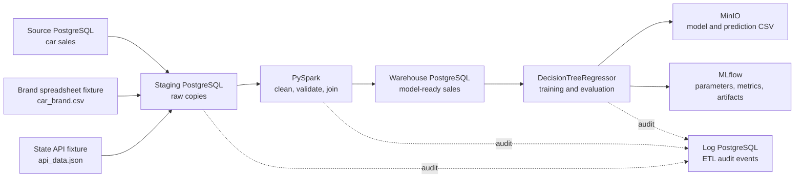
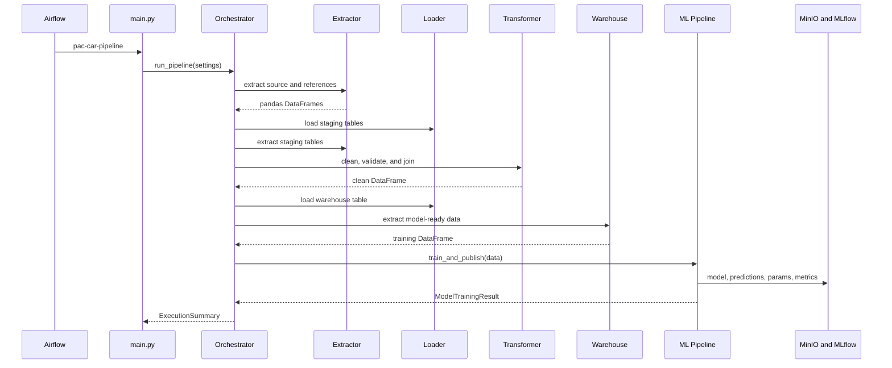

# Memahami PAC Car: ETL, Machine Learning, dan Prediction

Dokumen ini menjelaskan project PAC Car dari sudut pandang pembaca yang belum familiar dengan
data engineering atau machine learning. Tujuannya adalah menjawab empat pertanyaan:

1. Project ini sebenarnya melakukan apa?
2. Mengapa data perlu melewati beberapa database?
3. Bagaimana kode berjalan dari awal sampai akhir?
4. Bagaimana nilai `predicted_selling_price` ditentukan?

## Jawaban Singkat

PAC Car adalah pipeline otomatis untuk:

1. Mengambil data historis penjualan mobil dari beberapa sumber.
2. Membersihkan dan menyatukan data tersebut.
3. Menyimpan data yang sudah rapi ke data warehouse.
4. Melatih model untuk memperkirakan `selling_price` mobil.
5. Membandingkan hasil prediksi dengan harga penjualan aktual.
6. Menyimpan model, hasil prediksi, metrik, dan log agar proses dapat diaudit.

Project ini bukan aplikasi web tempat pengguna memasukkan spesifikasi mobil. Implementasi saat ini
adalah training dan evaluation pipeline. Model dilatih dan diuji menggunakan data historis yang
sudah memiliki harga penjualan aktual.

## Masalah yang Diselesaikan

Data mentah belum siap langsung digunakan untuk machine learning karena:

- transaksi penjualan berada di PostgreSQL source;
- referensi merek berada di file hasil ekspor spreadsheet;
- referensi state berada di data bergaya REST API;
- nama merek dan kode state belum berupa ID warehouse;
- beberapa nilai numerik kosong atau tidak valid;
- tipe data dari source belum konsisten;
- proses training perlu dapat diulang dan dilacak.

Pipeline mengubah sumber yang terpisah menjadi satu dataset warehouse yang konsisten dan siap
digunakan model.

## Gambaran Besar Sistem



Airflow memulai container `pac_car-pipeline:latest`. Di dalam container tersebut,
`pac_car.main:main` menjalankan seluruh urutan melalui orchestrator.

## Mengapa Ada Source, Staging, dan Warehouse?

Ketiga database mempunyai tanggung jawab berbeda.

| Layer | Isi | Alasan |
|---|---|---|
| Source | Data transaksi asli | Menjaga data input apa adanya |
| Staging | Salinan raw sales dan reference data | Menjadi area kerja sebelum transformasi |
| Warehouse | Data bersih, tervalidasi, dan sudah memakai ID reference | Menjadi sumber stabil untuk analisis dan ML |
| Log database | Status setiap tahap pipeline | Audit dan troubleshooting |

Staging bukan duplikasi tanpa tujuan. Layer ini memisahkan proses pengambilan data dari proses
pembersihan. Jika transformasi gagal, data raw yang sudah diekstrak tetap dapat diperiksa.

## Urutan Kode Saat Pipeline Berjalan



### 1. Entry point membaca konfigurasi

File `src/pac_car/main.py` memanggil `load_settings()` lalu `run_pipeline(settings)`.

`config/settings.py` membaca environment variable untuk:

- koneksi source, staging, warehouse, dan log database;
- endpoint dan credential MinIO;
- lokasi reference data;
- lokasi artifact dan log;
- rasio test data;
- random seed;
- alamat MLflow dan Spark master.

Konfigurasi dipisahkan dari business logic agar kode tidak bergantung pada alamat service tertentu.

### 2. Extractor membaca semua sumber

`CarSalesExtractor` menghasilkan Pandas DataFrame dari:

- `source_db.public.car_sales`;
- `dataset/car_brand.csv` melalui `BrandReferenceClient`;
- `dataset/api_data.json` melalui `StateReferenceClient`;
- staging dan warehouse ketika tahap berikutnya membutuhkan data tersebut.

Fixture lokal dipakai agar exercise reproducible tanpa credential Google Sheets atau koneksi API
eksternal. `StateReferenceClient` tetap mendukung remote API jika `api_url` diberikan.

### 3. Loader menyimpan data

`CarSalesLoader` menggunakan `PostgresClient` untuk:

- mengosongkan tabel tujuan;
- menulis data raw ke staging;
- menulis data hasil transformasi ke warehouse.

Load bersifat replace, sehingga setiap run menghasilkan snapshot tabel yang konsisten dan tidak
menumpuk duplikat dari run sebelumnya.

### 4. Transformer membersihkan data dengan PySpark

`CarSalesTransformer` melakukan hal berikut:

1. Mengubah kolom numerik ke tipe `int` atau `float`.
2. Membersihkan spasi dan token kosong pada kolom teks.
3. Mengubah `brand_car` menjadi `brand_car_id` dengan join ke brand reference.
4. Mengubah kode `state` menjadi `id_state` dengan join ke state reference.
5. Menolak row yang tidak memiliki kolom wajib.
6. Menolak tahun sebelum 1980, odometer negatif, MMR nonpositif, atau harga nonpositif.
7. Menghapus duplikat berdasarkan natural key `id_sales_nk`.

Hasilnya disimpan di warehouse dengan kolom:

| Kolom | Makna |
|---|---|
| `id_sales_nk` | ID transaksi dari source |
| `year` | Tahun mobil |
| `brand_car_id` | ID merek hasil mapping |
| `transmission` | Jenis transmisi |
| `id_state` | ID state hasil mapping |
| `condition` | Kondisi mobil |
| `odometer` | Jarak tempuh |
| `color` | Warna eksterior |
| `interior` | Warna atau tipe interior |
| `mmr` | Nilai acuan harga pasar pada dataset |
| `selling_price` | Harga penjualan aktual dan target model |

## Apa yang Diprediksi?

Model memprediksi satu angka:

```text
predicted_selling_price
```

Angka tersebut adalah estimasi `selling_price` dengan satuan yang sama seperti data historis.
Model ini merupakan supervised regression karena target historisnya berupa angka kontinu.

Model tidak memprediksi:

- apakah mobil akan terjual;
- merek mobil;
- kondisi mobil;
- keuntungan penjual;
- harga masa depan berdasarkan tanggal.

## Data yang Dipakai untuk Menentukan Prediction

Target tidak boleh dimasukkan sebagai feature. Pembagian kolom aktualnya adalah:

| Peran | Kolom |
|---|---|
| Target | `selling_price` |
| Numeric features | `year`, `brand_car_id`, `id_state`, `condition`, `odometer`, `mmr` |
| Categorical features | `transmission`, `color`, `interior` |

Secara sederhana, model belajar relasi berikut:

```text
selling_price = pola(year, brand_car_id, id_state, condition,
                    odometer, mmr, transmission, color, interior)
```

Ini bukan rumus yang ditulis manual oleh developer. Pola tersebut dipelajari dari data training.

## Bagaimana Prediction Ditentukan?

### Tahap 1: Menyiapkan data model

Method `_prepare_model_dataframe()`:

- memastikan seluruh feature dan target tersedia;
- memaksa numeric feature menjadi angka;
- mengganti categorical value kosong dengan `unknown`;
- membuang row yang feature numerik atau targetnya tidak valid.

Data warehouse pada clean run terakhir memiliki 28.818 row valid.

### Tahap 2: Membagi training dan test data

Kode menggunakan:

```python
train_test_split(
    features,
    target,
    test_size=0.2,
    random_state=42,
)
```

Artinya:

- sekitar 80% row dipakai untuk mengajari model;
- sekitar 20% row disimpan dan tidak diperlihatkan saat training;
- `random_state=42` membuat pembagian konsisten ketika data input tidak berubah.

Pada 28.818 row, pembagian ini kira-kira menghasilkan 23.054 training row dan 5.764 test row.

### Tahap 3: Mengubah kategori menjadi angka

Model scikit-learn tidak langsung memahami teks seperti `automatic`, `black`, atau `beige`.
`OneHotEncoder` mengubah kategori menjadi indikator angka.

Contoh sederhana:

| transmission | transmission_automatic | transmission_manual |
|---|---:|---:|
| automatic | 1 | 0 |
| manual | 0 | 1 |

`handle_unknown="ignore"` membuat kategori baru saat inference tidak langsung menyebabkan error.
Numeric features diteruskan tanpa scaling karena Decision Tree tidak bergantung pada jarak skala
seperti beberapa algoritma lain.

### Tahap 4: Decision Tree mempelajari aturan split

`DecisionTreeRegressor` membentuk aturan bercabang dari data training. Konfigurasinya:

| Parameter | Nilai | Efek |
|---|---:|---|
| `max_depth` | 8 | Membatasi kedalaman tree agar tidak terlalu kompleks |
| `min_samples_leaf` | 5 | Setiap leaf harus mewakili minimal 5 training row |
| `random_state` | 42 | Membantu reproducibility |

Ilustrasi konseptual, bukan rule persis model hasil training:

```text
Apakah mmr <= 12.000?
|- Ya: apakah year <= 2010?
|  |- Ya: prediksi dari rata-rata selling_price pada leaf A
|  `- Tidak: prediksi dari rata-rata selling_price pada leaf B
`- Tidak: apakah odometer <= 45.000?
   |- Ya: prediksi dari rata-rata selling_price pada leaf C
   `- Tidak: prediksi dari rata-rata selling_price pada leaf D
```

Saat satu mobil masuk, model mengikuti cabang berdasarkan feature mobil tersebut. Nilai prediction
adalah rata-rata target training row yang berakhir pada leaf yang sama.

Jadi prediction ditentukan oleh:

1. data historis yang dipakai training;
2. hasil one-hot encoding kategori;
3. threshold yang dipilih Decision Tree untuk mengurangi error;
4. leaf tempat row tersebut berakhir.

Prediction bukan angka acak dan bukan hasil mengambil langsung nilai `mmr`. Namun `mmr` biasanya
sangat informatif terhadap harga, sehingga feature ini dapat sangat memengaruhi cabang tree.

### Tahap 5: Menguji model pada data yang disisihkan

Setelah `model.fit(x_train, y_train)`, kode menjalankan:

```python
predictions = model.predict(x_test)
```

Karena test data berasal dari transaksi historis, nilai aktualnya masih tersedia sebagai `y_test`.
Ini memungkinkan perbandingan antara:

```text
actual_selling_price vs predicted_selling_price
```

File prediction CSV berisi feature dari test set ditambah dua kolom tersebut. File ini bukan
prediction untuk seluruh warehouse dan bukan prediction untuk mobil baru. Isinya adalah hasil
evaluasi pada 20% historical holdout data.

## Cara Membaca Metrik

Clean run terakhir menghasilkan:

| Metric | Nilai | Arti praktis |
|---|---:|---|
| R2 | `0.9708` | Model menjelaskan sekitar 97,08% variasi target pada test set |
| MAE | `1018.6319` | Rata-rata selisih absolut prediction sekitar 1.019 satuan harga |
| RMSE | `1661.8552` | Error besar diberi penalti lebih berat; nilainya sekitar 1.662 |

R2 `0.9708` bukan berarti "akurasi 97,08%". Regression tidak memakai accuracy seperti klasifikasi.
MAE lebih mudah dibaca sebagai rata-rata jarak prediction terhadap harga aktual. RMSE yang lebih
besar daripada MAE menunjukkan ada sebagian row dengan error yang relatif besar.

## Mengapa Skornya Tinggi?

Fitur `mmr` adalah nilai acuan harga pasar yang sangat dekat dengan konteks harga jual. Karena itu,
model mendapat sinyal kuat untuk menaksir `selling_price`.

Hal ini tidak otomatis merupakan data leakage, tetapi ada syarat penting: `mmr` harus benar-benar
tersedia pada saat prediction dilakukan. Jika MMR baru diketahui setelah penjualan, feature tersebut
tidak valid untuk use case prediction sebelum penjualan.

Skor test saat ini juga belum membuktikan model siap production karena:

- split dilakukan secara acak, bukan berdasarkan waktu;
- belum ada cross-validation;
- belum ada baseline sederhana sebagai pembanding;
- belum ada analisis feature importance;
- belum ada monitoring data drift;
- belum ada inference API untuk mobil baru.

## Bagaimana Model dan Prediction Disimpan?

Setelah evaluation:

1. seluruh scikit-learn Pipeline, termasuk encoder dan Decision Tree, disimpan dengan `joblib`;
2. model diberi nama `car_sales_decision_tree_<timestamp>.pkl`;
3. test prediction disimpan sebagai `car_sales_predictions_<timestamp>.csv`;
4. keduanya di-upload ke bucket MinIO `pac-car-models`;
5. parameter, metrik, model, dan prediction CSV dicatat ke MLflow.

Struktur object MinIO:

```text
pac-car-models/
|- models/
|  `- car_sales_decision_tree_<timestamp>.pkl
`- predictions/
   `- car_sales_predictions_<timestamp>.csv
```

MLflow menjawab pertanyaan "model ini dilatih dengan parameter dan metrik apa?". MinIO menjawab
pertanyaan "file model dan hasil prediction disimpan di mana?".

## Bagaimana Model Dipakai untuk Mobil Baru?

Kemampuan prediksi mobil baru sudah ada di artifact model, tetapi project saat ini belum menyediakan
API atau command khusus untuk inference. Secara konsep, model dapat digunakan seperti berikut
setelah file `.pkl` diunduh dari MinIO:

```python
import joblib
import pandas as pd

model = joblib.load("car_sales_decision_tree_<timestamp>.pkl")

new_car = pd.DataFrame(
    [
        {
            "year": 2014,
            "brand_car_id": 15,
            "id_state": 5,
            "condition": 40,
            "odometer": 35_000,
            "mmr": 18_500,
            "transmission": "automatic",
            "color": "black",
            "interior": "black",
        }
    ]
)

predicted_selling_price = model.predict(new_car)[0]
```

Input harus memakai nama kolom dan format yang sama dengan training. `brand_car_id` serta `id_state`
juga harus sudah melalui mapping reference yang benar.

## Tanggung Jawab Setiap File Utama

| File | Tanggung jawab |
|---|---|
| `dags/car_sales_pipeline_dag.py` | Mendefinisikan DAG Airflow dan menjalankan pipeline image |
| `src/pac_car/main.py` | Entry point command `pac-car-pipeline` |
| `config/settings.py` | Membaca dan memvalidasi konfigurasi environment |
| `clients/database_client.py` | Koneksi dan operasi DataFrame ke PostgreSQL |
| `clients/spreadsheet_client.py` | Membaca brand reference |
| `clients/reference_api_client.py` | Membaca state reference dari API atau fixture |
| `clients/object_storage_client.py` | Membuat bucket dan upload file ke MinIO |
| `pipeline/car_sales_extractor.py` | Query source, staging, dan warehouse |
| `pipeline/car_sales_loader.py` | Load DataFrame ke staging dan warehouse |
| `pipeline/car_sales_transformer.py` | Clean, validate, mapping, dan dedup dengan PySpark |
| `pipeline/car_sales_ml_pipeline.py` | Preprocessing, training, evaluation, dan artifact publishing |
| `pipeline/orchestrator.py` | Mengatur seluruh tahap secara berurutan dan menangani error global |
| `utils/logging.py` | Log ke console dan rotating file |
| `utils/etl_log_repository.py` | Menulis audit event ke log database |
| `utils/summary.py` | Membentuk summary akhir run |

Pembagian ini mengikuti separation of concerns. Misalnya, ML pipeline tidak perlu mengetahui cara
membuka koneksi PostgreSQL, sedangkan extractor tidak perlu mengetahui cara melatih model.

## Peran Docker Service

| Service | Fungsi |
|---|---|
| `source_db` | Menyediakan raw car sales data |
| `staging_db` | Menyimpan raw extract dan references |
| `warehouse_db` | Menyimpan data clean untuk model |
| `log_db` | Menyimpan audit event ETL |
| `spark-master` dan `spark-worker` | Menjalankan transformasi PySpark |
| `pipeline` | Image runtime kode Python ETL dan ML |
| `airflow-webserver` dan `airflow-scheduler` | Trigger, schedule, dan monitor pipeline |
| `mlflow` | Menyimpan histori experiment, parameter, dan metrik |
| `minio` | Object storage model dan prediction output |
| `notebook` | Eksplorasi data secara interaktif |

## Logging dan Penanganan Error

Pipeline mencatat aktivitas ke:

- console, agar terlihat di log Airflow;
- rotating log file, untuk audit lokal;
- `log_db.public.etl_log`, untuk status tahap ETL.

Jika satu tahap gagal, orchestrator:

1. menangkap exception;
2. mencatat stack trace;
3. menulis status gagal ke log database jika tersedia;
4. mencetak execution summary dengan status `FAILED`;
5. mengembalikan exit code nonzero melalui `main.py`.

## Manfaat Project

### Untuk data engineering

- Data dari beberapa sumber disatukan secara konsisten.
- Raw, working, dan clean data dipisahkan dengan jelas.
- Transformasi dapat dijalankan ulang dari Docker Compose.
- Invalid rows dihitung dan tidak diam-diam masuk warehouse.
- Log mempermudah audit dan troubleshooting.

### Untuk machine learning

- Training selalu memakai data warehouse yang sudah tervalidasi.
- Encoder dan model tersimpan dalam satu artifact sehingga preprocessing konsisten.
- Metrik dan parameter setiap run dapat dibandingkan melalui MLflow.
- Artifact tersimpan terpusat di MinIO dan tidak hanya berada di filesystem container.

### Untuk kebutuhan bisnis

- Model dapat menjadi dasar estimasi harga penjualan mobil.
- Selisih harga aktual dan prediction dapat membantu menemukan transaksi tidak biasa.
- Dataset warehouse dapat dipakai kembali untuk dashboard dan analisis lain.
- Proses otomatis mengurangi langkah manual yang sulit direproduksi.

Manfaat tersebut tetap harus dibaca sebagai fondasi teknis. Keputusan harga nyata memerlukan
validasi model yang lebih kuat, pemahaman satuan mata uang, data terbaru, dan review bisnis.

## Cara Menjalankan dan Melihat Hasil

Jalankan stack:

```bash
docker compose -f pac_car/docker-compose.yml up -d
```

Trigger melalui Airflow UI di `http://localhost:18080`, atau gunakan command yang tercantum pada
README. Setelah run selesai:

- Airflow menunjukkan status dan log workflow;
- MLflow di `http://localhost:15000` menunjukkan experiment dan metrics;
- MinIO Console di `http://localhost:19095` menunjukkan model serta prediction CSV;
- JupyterLab di `http://localhost:18888` dapat digunakan untuk eksplorasi data;
- ringkasan run terakhir tersedia di `report_summary.md`.

## Mental Model yang Perlu Diingat

```text
ETL membuat data layak dipercaya.
Warehouse menyediakan data siap pakai.
Training membuat model dari pola historis.
Prediction menerapkan pola tersebut pada feature input.
Evaluation mengukur jarak prediction dari nilai aktual.
MLflow dan MinIO membuat hasil training dapat dilacak dan digunakan ulang.
```

Dengan mental model tersebut, PAC Car dapat dipahami sebagai dua pipeline yang tersambung:

```text
Data Pipeline: sumber -> staging -> transform -> warehouse
ML Pipeline  : warehouse -> preprocessing -> training -> evaluation -> artifacts
```
